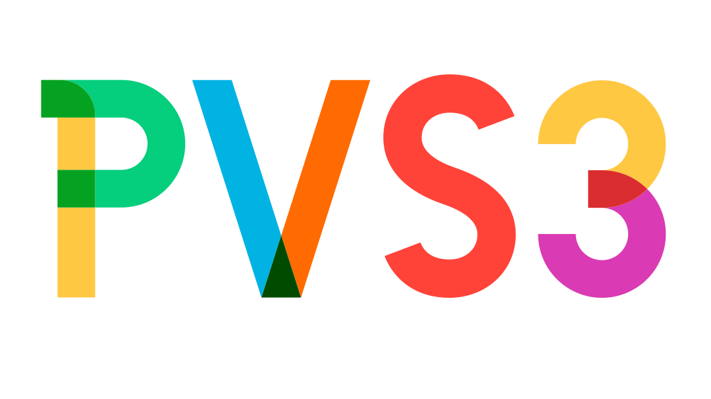

<h1 align="center">
  
</h1>

## Introduction

pvs3 is a simple docker image for backing up and restoring directories using S3. It's based on [yacron](https://github.com/gjcarneiro/yacron), and is meant to be used as a sidecar for backups, or as an init container for restores.

## Configuration

| Env Variable | Description |
| --- | --- |
| `TARGET_DIR` | The directory to backup or restore |
| `CRON_SCHEDULE` | The cron schedule for backups. This can be a string in a crontab format specified by [`parse-crontab`](https://github.com/josiahcarlson/parse-crontab) (the module used by yacron). |
| `AWS_ACCESS_KEY_ID` | The AWS access key ID |
| `AWS_SECRET_ACCESS_KEY` | The AWS secret access key |
| `AWS_S3_BUCKET` | The AWS S3 bucket |
| `AWS_S3_PREFIX` | The AWS S3 prefix |

## Permissions

The following IAM policy is required for pvs3 to access the S3 bucket. Make sure attach it to the IAM user or role that pvs3 is running as. See [Adding and removing IAM identity permissions](https://docs.aws.amazon.com/IAM/latest/UserGuide/access_policies_manage-attach-detach.html) for more information.

```json
{
  "Version": "2012-10-17",
  "Statement": [
    {
      "Sid": "pvs3",
      "Effect": "Allow",
      "Action": [
        "s3:ListBucket",
        "s3:GetObject",
        "s3:PutObject"
      ],
      "Resource": [
        "arn:aws:s3:::<AWS_S3_BUCKET>",
        "arn:aws:s3:::<AWS_S3_BUCKET>/<AWS_S3_PREFIX>/*"
      ]
    }
  ]
}
```

## Backup

Files are stored in the target bucket/prefix as `backup-YYYY-MM-DD-HH-MM-SS.tar.gz`. You may need to include a volume mount for `/etc/yacron.d`, depending on your docker setup.

### Docker

```bash
docker run \
  -e TARGET_DIR="/var/lib/grafana" \
  -e CRON_SCHEDULE="*/15 * * * *" \
  -e AWS_ACCESS_KEY_ID="<AWS_ACCESS_KEY_ID>" \
  -e AWS_SECRET_ACCESS_KEY="<AWS_SECRET_ACCESS_KEY>" \
  -e AWS_S3_BUCKET="backups" \
  -e AWS_S3_PREFIX="grafana" \
  pvs3 backup
```

### Kubernetes

```yaml
# manifest.yaml
extraContainers:
  - name: backup
    image: nallenscott/pvs3:latest
    command: ['/pvs3/entrypoint.sh']
    args: ['backup']
    volumeMounts:
      - name: storage
        mountPath: /var/lib/grafana
      - name: yacrontab
        mountPath: /etc/yacron.d
    env:
      - name: TARGET_DIR
        value: /var/lib/grafana
      - name: CRON_SCHEDULE
        value: "*/15 * * * *"
      - name: AWS_ACCESS_KEY_ID
        value: <AWS_ACCESS_KEY_ID>
      - name: AWS_SECRET_ACCESS_KEY
        value: <AWS_SECRET_ACCESS_KEY>
      - name: AWS_DEFAULT_REGION
        value: us-east-1
      - name: AWS_S3_BUCKET
        value: backups
      - name: AWS_S3_PREFIX
        value: grafana
```

## Restore

This will overwrite the contents of the target directory with the most recent backup.

### Docker

```bash
docker run \
  -e TARGET_DIR="/var/lib/grafana" \
  -e AWS_ACCESS_KEY_ID="<AWS_ACCESS_KEY_ID>" \
  -e AWS_SECRET_ACCESS_KEY="<AWS_SECRET_ACCESS_KEY>" \
  -e AWS_S3_BUCKET="backups" \
  -e AWS_S3_PREFIX="grafana" \
  pvs3 restore
```

### Kubernetes

```yaml
# manifest.yaml
initContainers:
  - name: restore
    image: nallenscott/pvs3:latest
    command: ['/pvs3/entrypoint.sh']
    args: ['restore']
    volumeMounts:
      - name: storage
        mountPath: /var/lib/grafana
    env:
      - name: TARGET_DIR
        value: /var/lib/grafana
      - name: AWS_ACCESS_KEY_ID
        value: <AWS_ACCESS_KEY_ID>
      - name: AWS_SECRET_ACCESS_KEY
        value: <AWS_SECRET_ACCESS_KEY>
      - name: AWS_DEFAULT_REGION
        value: us-east-1
      - name: AWS_S3_BUCKET
        value: backups
      - name: AWS_S3_PREFIX
        value: grafana
```
